# Project K: AI Agriculture System Architecture

> **Version**: 3.0  
> **Date**: December 29, 2025  
> **Purpose**: AI Solutions Architecture for Precision Agriculture

---

## Table of Contents

1. [Architecture Overview](#1-architecture-overview)
   - 1.5 [Frontend User Flow](#15-frontend-user-flow)
2. [Components](#2-components)
3. [CSV File Design](#3-csv-file-design)
4. [ML Model Flow](#4-ml-model-flow)
5. [Report Template](#5-report-template)
6. [Chatbot Design](#6-chatbot-design)
7. [Risks and Improvements](#7-risks-and-improvements)
8. [Implementation Status & Upcoming Features](#8-implementation-status--upcoming-features)

---

## 1. Architecture Overview

### System Diagram

```
┌─────────────────────────────────────────────────────────────────────────────────┐
│                           PROJECT K: AI AGRICULTURE SYSTEM                       │
├─────────────────────────────────────────────────────────────────────────────────┤
│                                                                                  │
│  ┌─────────────────────────────────────────────────────────────────────────┐    │
│  │                        LAYER 1: DATA INGESTION                           │    │
│  │  ┌──────────┐ ┌──────────┐ ┌──────────┐ ┌──────────┐ ┌──────────────┐   │    │
│  │  │ Sentinel │ │ Weather  │ │   Soil   │ │  Yield   │ │ Ground Robot │   │    │
│  │  │   GEE    │ │ ERA5/    │ │ SSURGO   │ │ USDA/    │ │   Sensors    │   │    │
│  │  │          │ │ CHIRPS   │ │ SoilGrids│ │ User     │ │   Images     │   │    │
│  │  └────┬─────┘ └────┬─────┘ └────┬─────┘ └────┬─────┘ └──────┬───────┘   │    │
│  └───────┼────────────┼────────────┼────────────┼──────────────┼───────────┘    │
│          │            │            │            │              │                 │
│  ┌───────▼────────────▼────────────▼────────────▼──────────────▼───────────┐    │
│  │                     LAYER 2: DATA STANDARDIZATION                        │    │
│  │  • Schema validation  • Unit normalization  • Timestamp alignment        │    │
│  │  • Field ID mapping   • Coordinate system (WGS84)  • Quality flags       │    │
│  └─────────────────────────────────┬───────────────────────────────────────┘    │
│                                    │                                             │
│  ┌─────────────────────────────────▼───────────────────────────────────────┐    │
│  │                        LAYER 3: CSV STORAGE                              │    │
│  │                                                                          │    │
│  │  data/                                                                   │    │
│  │  ├── weather/          # weather.csv, forecast.csv                       │    │
│  │  ├── satellite/        # field_stats.csv, imagery metadata               │    │
│  │  ├── soil/             # soil.csv, nutrients.csv                         │    │
│  │  ├── yield_data/       # user_yields.csv, county_yields.csv              │    │
│  │  ├── robot_data/       # observations.csv, images.csv, sensors.csv       │    │
│  │  ├── processed/        # combined_features.csv, derived_metrics.csv      │    │
│  │  └── models/           # predictions.csv, feature_importance.csv         │    │
│  └─────────────────────────────────┬───────────────────────────────────────┘    │
│                                    │                                             │
│  ┌─────────────────────────────────▼───────────────────────────────────────┐    │
│  │                        LAYER 4: ML MODELING                              │    │
│  │                                                                          │    │
│  │  ┌────────────────┐  ┌────────────────┐  ┌────────────────────────────┐ │    │
│  │  │ Yield Predict  │  │ Anomaly Detect │  │ Classification Models      │ │    │
│  │  │ XGBoost/LGBM   │  │ Isolation      │  │ • Crop Health Score        │ │    │
│  │  │ CatBoost/RF    │  │ Forest         │  │ • Stress Classification    │ │    │
│  │  │ ElasticNet     │  │                │  │ • Pest/Disease Risk        │ │    │
│  │  └────────────────┘  └────────────────┘  └────────────────────────────┘ │    │
│  └─────────────────────────────────┬───────────────────────────────────────┘    │
│                                    │                                             │
│  ┌─────────────────────────────────▼───────────────────────────────────────┐    │
│  │              LAYER 5: AI REASONING (LangGraph Multi-Agent)               │    │
│  │                                                                          │    │
│  │  ┌─────────────────────────────────────────────────────────────────────┐│    │
│  │  │                    CSV → Context Loader                             ││    │
│  │  │  • Load all CSVs  • Filter by field_id  • Calculate derived metrics││    │
│  │  └───────────────────────────┬─────────────────────────────────────────┘│    │
│  │                              │ (parallel)                                │    │
│  │  ┌───────────┬───────────┬───┴───────┬───────────┬───────────┐          │    │
│  │  │ Weather   │ Soil      │ Satellite │ Crop      │ Yield     │          │    │
│  │  │ Agent     │ Agent     │ Agent     │ Health    │ Historian │          │    │
│  │  │ (Flash)   │ (Flash)   │ (Flash)   │ (Flash)   │ (Flash)   │          │    │
│  │  │           │           │           │           │           │          │    │
│  │  │ ERA5      │ SSURGO    │ NDVI/     │ Robot     │ County/   │          │    │
│  │  │ CHIRPS    │ pH, OM    │ NDMI      │ data      │ user      │          │    │
│  │  │ TerraClim │ nutrients │ trends    │ pest/weed │ yields    │          │    │
│  │  └─────┬─────┴─────┬─────┴─────┬─────┴─────┬─────┴─────┬─────┘          │    │
│  │        │           │           │           │           │                 │    │
│  │        └───────────┴───────────┼───────────┴───────────┘                 │    │
│  │                                ▼                                         │    │
│  │  ┌─────────────────────────────────────────────────────────────────────┐│    │
│  │  │              REPORT AGENT (Gemini 2.5 Flash)                        ││    │
│  │  │  • Synthesize 5 specialist reports  • Resolve conflicts            ││    │
│  │  │  • Prioritize recommendations       • Cite sources + confidence    ││    │
│  │  └──────────────────────────────┬──────────────────────────────────────┘│    │
│  └─────────────────────────────────┼───────────────────────────────────────┘    │
│                                    │                                             │
│  ┌─────────────────────────────────▼───────────────────────────────────────┐    │
│  │                        LAYER 6: OUTPUT GENERATION                        │    │
│  │                                                                          │    │
│  │  ┌─────────────────────┐              ┌─────────────────────────────┐   │    │
│  │  │   FARM REPORT       │              │      AI CHATBOT             │   │    │
│  │  │   • Executive       │              │   • Question → Retrieval    │   │    │
│  │  │   • Crop Health     │              │   • Context + LLM           │   │    │
│  │  │   • Water/Nutrients │              │   • Answer + Citations      │   │    │
│  │  │   • Recommendations │              │   • Confidence + Caveats    │   │    │
│  │  └─────────────────────┘              └─────────────────────────────┘   │    │
│  └─────────────────────────────────────────────────────────────────────────┘    │
│                                                                                  │
│  ┌─────────────────────────────────────────────────────────────────────────┐    │
│  │                      LAYER 7: GOVERNANCE & MONITORING                    │    │
│  │  • Data versioning  • Model versioning  • Audit logs  • Privacy controls│    │
│  └─────────────────────────────────────────────────────────────────────────┘    │
└─────────────────────────────────────────────────────────────────────────────────┘
```

### Complete Architecture (Mermaid)


### Key Design Principles

| Principle | Implementation |
|-----------|----------------|
| **CSV-First** | All data stored in CSVs for transparency and auditability |
| **Field-Centric** | Every record linked to `field_id` for multi-field support |
| **Time-Indexed** | All data timestamped for temporal analysis |
| **Source-Tagged** | Every value tagged with `data_source` for traceability |
| **LLM-Readable** | CSVs designed for direct injection into LLM context |

---

### 1.5 Frontend User Flow

#### Complete User Journey

```
┌─────────────────────────────────────────────────────────────────────────────────────────┐
│                              PROJECT K: USER JOURNEY                                     │
├─────────────────────────────────────────────────────────────────────────────────────────┤
│                                                                                          │
│  ┌──────────────┐    ┌──────────────┐    ┌──────────────┐    ┌──────────────┐           │
│  │  1. LANDING  │───▶│  2. MAP      │───▶│ 3. PARAMS    │───▶│ 4. PIPELINE  │           │
│  │     PAGE     │    │   SELECT     │    │    INPUT     │    │   PROGRESS   │           │
│  │              │    │              │    │              │    │              │           │
│  │ • Welcome    │    │ • Draw field │    │ • Crop type  │    │ • 8 Steps    │           │
│  │ • Features   │    │ • Leaflet    │    │ • Planting   │    │ • Real-time  │           │
│  │ • Tech stack │    │ • GeoJSON    │    │ • Yield hist │    │ • Progress   │           │
│  │ • Start btn  │    │ • Confirm    │    │ • Robot data │    │ • Logs       │           │
│  └──────────────┘    └──────────────┘    └──────────────┘    └──────────────┘           │
│                                                                      │                   │
│                                                                      ▼                   │
│  ┌──────────────┐    ┌──────────────┐    ┌──────────────┐    ┌──────────────┐           │
│  │ 8. PRESCRIP  │◀───│  7. CHATBOT  │◀───│ 6. AI REPORT │◀───│  5. RESULTS  │           │
│  │     MAPS     │    │              │    │              │    │   DASHBOARD  │           │
│  │              │    │              │    │              │    │              │           │
│  │ • VRA zones  │    │ • Ask field  │    │ • Gemini AI  │    │ • Yield pred │           │
│  │ • K-means    │    │ • Context    │    │ • Structured │    │ • Health     │           │
│  │ • Rate map   │    │ • Citations  │    │ • Recommends │    │ • NDVI trend │           │
│  │ • Download   │    │ • History    │    │ • Confidence │    │ • Weather    │           │
│  └──────────────┘    └──────────────┘    └──────────────┘    └──────────────┘           │
│                                                                                          │
└─────────────────────────────────────────────────────────────────────────────────────────┘
```

#### Page Descriptions

| Page | Component | Purpose | Key Features |
|------|-----------|---------|--------------|
| **1. Landing** | `LandingPage.js` | Welcome & navigation | Features showcase, tech stack, animations, "Get Started" CTA |
| **2. Map** | `YieldPredictionMap.js` | Field boundary selection | Leaflet map, polygon drawing, location search, GeoJSON export |
| **3. Parameters** | `ParametersPage.js` | Crop & yield input | Crop type, planting date, growth stage, historical yields, robot data |
| **4. Processing** | `PipelineProgress.js` | Pipeline execution | Real-time progress (8 steps), logs, cancel support, ETA |
| **5. Results** | `ResultsPage.js` | Analysis dashboard | Yield predictions, NDVI trends, health scores, weather summary |
| **6. AI Report** | `AIReport.jsx` | Generated insights | Gemini-powered report, recommendations, citations, confidence |
| **7. Chatbot** | `ChatbotPage.js` | Interactive Q&A | Context-aware responses, field data, follow-up questions |
| **8. Prescription** | `PrescriptionPage.js` | VRA maps | Zone-based rates, K-means clustering, downloadable shapefile |

#### Backend API Integration


#### Pipeline Steps (8-Step Processing)

| Step | Name | Module | Output |
|------|------|--------|--------|
| 1 | Download Imagery | `sentinel.py` | GeoTIFF files, `field_stats.csv` |
| 2 | Collect Soil Data | `soil.py` | `soil_data.csv` |
| 3 | Fetch Weather | `weather.py` | `era5_data.csv`, `chirps_data.csv`, `terraclimate_data.csv` |
| 4 | Get USDA Yields | `usda_data.py` | `county_yields.csv` |
| 5 | Run Anomaly Detection | `anomaly_detector.py` | `anomaly_flags.csv` |
| 6 | Calculate Health Score | `health_scorer.py` | `crop_health_scores.csv` |
| 7 | Train ML Models | `auto_model.py` | `model_predictions.csv`, `*.joblib` |
| 8 | Generate AI Report | `report_agent.py` | JSON report with recommendations |

#### Motion System (Animations)

The frontend uses a centralized animation system via Framer Motion:

| Component | File | Purpose |
|-----------|------|---------|
| Motion Tokens | `motion/tokens.js` | Timing, easing, spring configs |
| Motion Variants | `motion/variants.js` | Reusable animation presets |
| Motion Hooks | `motion/hooks/` | `useScrollReveal`, `useParallax`, `useCounter` |
| Motion Components | `motion/components/` | `AnimatedCard`, `MagneticButton`, `StaggerContainer` |

---

## 2. Components

### 2.1 Data Ingestion Layer

| Source | API/Method | Frequency | Handler Module | Status |
|--------|------------|-----------|----------------|--------|
| **Sentinel-2** | Google Earth Engine | Every 5 days | `sentinel.py` | ✅ Implemented |
| **ERA5-Land** | GEE / Copernicus | Monthly aggregation | `weather.py` | ✅ Implemented |
| **CHIRPS** | GEE | Monthly | `weather.py` | ✅ Implemented |
| **TerraClimate** | GEE | Monthly | `weather.py` | ✅ Implemented |
| **SSURGO Soil** | USDA SDA API | Static (annual) | `soil.py` | ✅ Implemented |
| **SoilGrids** | REST API | Static | `soil.py` | ✅ Implemented |
| **USDA Yields** | NASS QuickStats API | Annual | `usda_data.py` | ✅ Implemented |
| **User Yields** | Frontend form | On-demand | `user_yield_handler.py` | ✅ Implemented |
| **Ground Robot** | REST API / CSV | On-demand | `robot_data.py` | ✅ Implemented |
| **Weather Forecast** | OpenWeatherMap / Tomorrow.io | Daily | `forecast.py` | 🔲 Planned |

### 2.2 Data Standardization Rules

| Aspect | Standard |
|--------|----------|
| **Coordinate System** | WGS84 (EPSG:4326) |
| **Timestamp Format** | ISO 8601: `YYYY-MM-DDTHH:MM:SS` |
| **Date Format** | `YYYY-MM-DD` |
| **Field ID Format** | `field_{hash}_{farm_id}` |
| **Temperature Units** | Celsius (°C) |
| **Precipitation Units** | Millimeters (mm) |
| **Yield Units** | Bushels/acre (bu/acre) |
| **Nutrient Units** | kg/ha or ppm |
| **Missing Values** | Empty string (CSV), `null` (JSON) |
| **Boolean Values** | `true` / `false` (lowercase) |

### 2.3 CSV Storage Design

**Folder Structure:**

```
data/
├── weather/
│   ├── era5_data.csv              # Historical ERA5 climate
│   ├── chirps_data.csv            # CHIRPS precipitation
│   ├── terraclimate_data.csv      # TerraClimate metrics
│   ├── weather_summary.csv        # Aggregated weather summary
│   └── forecast.csv               # 7-day weather forecast
│
├── satellite/
│   ├── field_stats.csv            # Per-observation vegetation indices
│   ├── imagery_metadata.csv       # Downloaded image catalog
│   └── zone_stats.csv             # Management zone statistics (🔲 PLANNED)
│
├── soil/
│   ├── soil_properties.csv        # Static soil properties
│   └── soil_nutrients.csv         # Lab test results (if available)
│
├── yield_data/
│   ├── user_yield_input.csv       # User-provided field yields
│   ├── county_yields.csv          # USDA county averages
│   └── usda_validation.csv        # Validation dataset
│
├── robot_data/
│   ├── observations.csv           # Field observations (plants, spacing)
│   ├── image_catalog.csv          # Ground images metadata
│   ├── sensor_readings.csv        # Sensor data (moisture, EC, etc.)
│   └── scouting_notes.csv         # Manual scouting inputs (🔲 PLANNED)
│
├── processed/
│   ├── combined_features.csv      # ML training features
│   ├── derived_metrics.csv        # Calculated indicators (🔲 PLANNED)
│   ├── anomaly_flags.csv          # Anomaly detection output ✅
│   └── zone_assignments.csv       # Management zone mapping ✅ (via prescription.py)
│
├── models/
│   ├── model_predictions.csv      # Yield predictions
│   ├── feature_importance.csv     # Feature importance scores
│   └── model_predictions.csv      # Model predictions + metadata ✅
│
└── reports/
    ├── farm_reports/              # Generated PDF/MD reports
    └── chat_logs/                 # Chatbot conversation logs
```

---

## 3. CSV File Design

### 3.1 Core CSV Schemas

#### `weather/era5_data.csv`

| Column | Type | Required | Description |
|--------|------|----------|-------------|
| `field_id` | str | Yes | Field identifier |
| `year` | int | Yes | Year of observation |
| `month` | int | Yes | Month (1-12) |
| `date` | str | No | Specific date if available |
| `avg_temp_C` | float | Yes | Average 2m air temperature |
| `max_temp_C` | float | No | Maximum temperature |
| `min_temp_C` | float | No | Minimum temperature |
| `precip_mm` | float | Yes | Total precipitation |
| `soil_temp_C` | float | No | Soil temperature (0-7cm) |
| `soil_moisture_m3m3` | float | No | Volumetric soil moisture |
| `evapotranspiration_mm` | float | No | Actual ET |
| `is_growing_season` | bool | Yes | True if March-September |
| `data_source` | str | Yes | "ERA5-Land" |
| `collection_date` | datetime | Yes | When fetched |
| `quality_flag` | str | No | "good" / "interpolated" / "estimated" |

---

#### `weather/chirps_data.csv` ✅

| Column | Type | Required | Description |
|--------|------|----------|-------------|
| `year` | int | Yes | Year of observation |
| `month` | int | Yes | Month (1-12) |
| `month_name` | str | Yes | Month name (Jan, Feb, etc.) |
| `precip_mm` | float | Yes | Monthly precipitation in mm |
| `is_growing_season` | bool | Yes | True if March-September |
| `field_lat` | float | Yes | Field latitude |
| `field_lon` | float | Yes | Field longitude |
| `collection_date` | datetime | Yes | When data was fetched |

---

#### `weather/forecast.csv` (🔲 PLANNED)

| Column | Type | Required | Description |
|--------|------|----------|-------------|
| `field_id` | str | Yes | Field identifier |
| `forecast_date` | str | Yes | Date forecast is for |
| `issued_date` | datetime | Yes | When forecast was issued |
| `temp_high_C` | float | Yes | Forecasted high temperature |
| `temp_low_C` | float | Yes | Forecasted low temperature |
| `precip_mm` | float | Yes | Forecasted precipitation |
| `precip_probability` | float | No | Probability of precipitation (0-1) |
| `humidity_pct` | float | No | Relative humidity |
| `wind_speed_kmh` | float | No | Wind speed |
| `cloud_cover_pct` | float | No | Cloud cover percentage |
| `uv_index` | int | No | UV index |
| `gdd_forecast` | float | No | Forecasted GDD |
| `frost_risk` | bool | No | True if temp_low < 0°C |
| `data_source` | str | Yes | "OpenWeatherMap" / "Tomorrow.io" |

---

#### `satellite/field_stats.csv`

| Column | Type | Required | Description |
|--------|------|----------|-------------|
| `field_id` | str | Yes | Field identifier |
| `date` | str | Yes | Observation date |
| `NDVI` | float | Yes | Normalized Difference Vegetation Index |
| `GCVI` | float | Yes | Green Chlorophyll Vegetation Index |
| `NDRE` | float | Yes | Normalized Difference Red Edge |
| `REIP` | float | Yes | Red Edge Inflection Point |
| `NDMI` | float | Yes | Normalized Difference Moisture Index |
| `B2_Blue` | float | No | Blue band mean reflectance |
| `B3_Green` | float | No | Green band mean reflectance |
| `B4_Red` | float | No | Red band mean reflectance |
| `B8_NIR` | float | No | NIR band mean reflectance |
| `cloud_cover_pct` | float | No | Cloud cover in scene |
| `pixel_count` | int | No | Number of valid pixels |
| `data_source` | str | Yes | "Sentinel-2" |
| `quality_flag` | str | No | "good" / "cloudy" / "partial" |

---

#### `satellite/zone_stats.csv` (🔲 PLANNED)

| Column | Type | Required | Description |
|--------|------|----------|-------------|
| `field_id` | str | Yes | Field identifier |
| `zone_id` | str | Yes | Management zone ID (e.g., "zone_1") |
| `date` | str | Yes | Observation date |
| `zone_area_ha` | float | Yes | Zone area in hectares |
| `NDVI_mean` | float | Yes | Mean NDVI for zone |
| `NDVI_std` | float | Yes | NDVI standard deviation |
| `NDMI_mean` | float | Yes | Mean NDMI for zone |
| `relative_vigor` | str | Yes | "low" / "medium" / "high" |
| `anomaly_flag` | bool | No | True if significantly different from field average |

---

#### `soil/soil_properties.csv`

| Column | Type | Required | Description |
|--------|------|----------|-------------|
| `field_id` | str | Yes | Field identifier |
| `lat` | float | Yes | Latitude |
| `lon` | float | Yes | Longitude |
| `texture_class` | str | Yes | "clay" / "loam" / "sandy" / etc. |
| `clay_pct` | float | No | Clay percentage |
| `sand_pct` | float | No | Sand percentage |
| `silt_pct` | float | No | Silt percentage |
| `organic_matter_pct` | float | No | Organic matter percentage |
| `ph` | float | No | Soil pH |
| `cec_meq100g` | float | No | Cation exchange capacity |
| `available_water_mm` | float | Yes | Plant-available water capacity |
| `drainage_class` | str | No | "well" / "moderate" / "poor" |
| `depth_to_restrictive_cm` | float | No | Root limiting layer depth |
| `crop_productivity_index` | float | Yes | 0-1 scale |
| `data_source` | str | Yes | "SSURGO" / "SoilGrids" / "lab_test" |
| `collection_date` | datetime | Yes | When fetched or sampled |

---

#### `soil/soil_nutrients.csv` (NEW - Lab Tests)

| Column | Type | Required | Description |
|--------|------|----------|-------------|
| `field_id` | str | Yes | Field identifier |
| `zone_id` | str | No | Management zone if applicable |
| `sample_date` | str | Yes | When sample was collected |
| `lab_name` | str | Yes | Laboratory name |
| `nitrogen_ppm` | float | No | Available nitrogen |
| `phosphorus_ppm` | float | No | Phosphorus (Mehlich-3) |
| `potassium_ppm` | float | No | Potassium |
| `sulfur_ppm` | float | No | Sulfur |
| `calcium_ppm` | float | No | Calcium |
| `magnesium_ppm` | float | No | Magnesium |
| `zinc_ppm` | float | No | Zinc |
| `manganese_ppm` | float | No | Manganese |
| `iron_ppm` | float | No | Iron |
| `boron_ppm` | float | No | Boron |
| `copper_ppm` | float | No | Copper |
| `ph` | float | Yes | Soil pH |
| `buffer_ph` | float | No | Buffer pH for lime recommendation |
| `ec_dS_m` | float | No | Electrical conductivity |
| `data_source` | str | Yes | "lab_test" |

---

#### `yield_data/user_yield_input.csv`

| Column | Type | Required | Description |
|--------|------|----------|-------------|
| `field_id` | str | Yes | Field identifier |
| `year` | int | Yes | Harvest year |
| `crop_type` | str | Yes | Crop type |
| `variety` | str | No | Crop variety/hybrid |
| `yield_bu_acre` | float | Yes | Yield in bushels/acre |
| `yield_kg_ha` | float | No | Yield in kg/ha |
| `planting_date` | str | No | Planting date |
| `harvest_date` | str | No | Harvest date |
| `seeding_rate` | float | No | Seeds per acre |
| `row_spacing_in` | float | No | Row spacing in inches |
| `notes` | str | No | User notes |
| `data_source` | str | Yes | "user_input" |
| `created_at` | datetime | Yes | Record creation time |
| `updated_at` | datetime | No | Last update time |

---

#### `yield_data/user_input_ground_robot_data.csv` ✅

> **Note:** The original design specified `robot_data/observations.csv` with more detailed fields. The current implementation uses a simplified schema stored in `yield_data/`.

| Column | Type | Required | Description |
|--------|------|----------|-------------|
| `field_id` | str | Yes | Field identifier |
| `date` | str | Yes | Observation date |
| `plants_in_sample` | float | No | Number of plants counted in sample |
| `row_length` | float | No | Length of sampled row (feet) |
| `row_spacing` | float | No | Row spacing (inches) |
| `avg_ndvi` | float | No | Average NDVI from ground sensor |
| `notes` | str | No | Observer notes |
| `created_at` | datetime | Yes | Record creation timestamp |

**Future expansion** (from original design, not yet implemented):
- GPS coordinates (lat/lon)
- Plant height, vigor score
- Pest/disease detection flags
- Image IDs |

---

#### `robot_data/sensor_readings.csv` (🔲 PLANNED)

| Column | Type | Required | Description |
|--------|------|----------|-------------|
| `reading_id` | str | Yes | Unique reading ID |
| `field_id` | str | Yes | Field identifier |
| `zone_id` | str | No | Management zone |
| `timestamp` | datetime | Yes | Reading timestamp |
| `lat` | float | Yes | GPS latitude |
| `lon` | float | Yes | GPS longitude |
| `soil_moisture_pct` | float | No | Volumetric soil moisture |
| `soil_temp_C` | float | No | Soil temperature |
| `canopy_temp_C` | float | No | Canopy temperature |
| `air_temp_C` | float | No | Ambient air temperature |
| `ec_mS_cm` | float | No | Electrical conductivity |
| `ndvi_sensor` | float | No | Ground-level NDVI sensor |
| `par_umol` | float | No | Photosynthetically active radiation |
| `sensor_id` | str | Yes | Sensor identifier |
| `data_source` | str | Yes | "robot_sensor" |

---

#### `processed/derived_metrics.csv` (🔲 PLANNED)

| Column | Type | Required | Description |
|--------|------|----------|-------------|
| `field_id` | str | Yes | Field identifier |
| `date` | str | Yes | Calculation date |
| `ndvi_7d_change` | float | No | NDVI change over 7 days |
| `ndvi_trend` | str | No | "improving" / "stable" / "declining" |
| `gdd_cumulative` | float | No | Cumulative GDD for season |
| `precip_30d_mm` | float | No | 30-day precipitation total |
| `water_stress_index` | float | No | 0-1 water stress indicator |
| `vegetation_uniformity` | float | No | Coefficient of variation |
| `yield_forecast_bu` | float | No | Current yield forecast |
| `yield_confidence` | float | No | Forecast confidence (0-1) |
| `crop_health_score` | float | No | 0-100 health score |
| `days_to_maturity` | int | No | Estimated days to harvest |
| `risk_score` | float | No | Combined risk indicator |

---

#### `processed/anomaly_flags.csv` ✅

| Column | Type | Required | Description |
|--------|------|----------|-------------|
| `field_id` | str | Yes | Field identifier |
| `zone_id` | str | No | Zone if applicable |
| `detected_date` | str | Yes | When anomaly was detected |
| `anomaly_type` | str | Yes | Type of anomaly |
| `severity` | str | Yes | "low" / "medium" / "high" / "critical" |
| `metric_name` | str | Yes | Which metric triggered it |
| `metric_value` | float | Yes | Actual value |
| `expected_range` | str | Yes | Expected range (e.g., "0.6-0.8") |
| `description` | str | Yes | Human-readable description |
| `recommended_action` | str | No | Suggested action |
| `resolved` | bool | Yes | Whether issue is resolved |
| `resolved_date` | str | No | When resolved |

---

### 3.2 Data Joining Strategy

#### Primary Keys

| CSV File | Primary Key | Foreign Keys |
|----------|-------------|--------------|
| All files | `field_id` | - |
| Time-series | `field_id` + `date` | - |
| Zone data | `field_id` + `zone_id` | `field_id` |
| Observations | `observation_id` | `field_id`, `zone_id` |

#### Join Rules

```python
# Example: Join satellite with weather data
def join_satellite_weather(satellite_df, weather_df):
    """
    Join Rules:
    1. Match on field_id (exact)
    2. Match on year + month (temporal alignment)
    3. Weather is monthly, satellite may be per-observation
    """
    satellite_df['year'] = pd.to_datetime(satellite_df['date']).dt.year
    satellite_df['month'] = pd.to_datetime(satellite_df['date']).dt.month
    
    merged = satellite_df.merge(
        weather_df,
        on=['field_id', 'year', 'month'],
        how='left',
        suffixes=('', '_weather')
    )
    return merged

# Spatial alignment for point data  
def nearest_date_match(target_date, available_dates, max_days=7):
    """Find nearest date within tolerance"""
    target = pd.to_datetime(target_date)
    available = pd.to_datetime(available_dates)
    deltas = abs(available - target)
    min_idx = deltas.argmin()
    if deltas[min_idx].days <= max_days:
        return available_dates[min_idx]
    return None
```

#### Handling Missing Data

| Scenario | Strategy |
|----------|----------|
| Missing weather month | Interpolate from adjacent months |
| Missing satellite observation | Use nearest valid observation within 14 days |
| Missing soil data | Use regional defaults from SoilGrids |
| Missing yield data | Use county average (lower weight) |
| Conflicting sources | Flag in `quality_flag`, prefer higher-resolution source |

---

## 4. ML Model Flow

### 4.1 Model Architecture (Actual Implementation)


### 4.2 Data Flow Details

#### Feature Source: `field_stats.csv`

| Column | Description | Example |
|--------|-------------|---------|
| `date` | Observation date | 2024-07-15 |
| `NDVI` | Normalized Difference Vegetation Index | 0.72 |
| `GCVI` | Green Chlorophyll Vegetation Index | 2.45 |
| `NDRE` | Normalized Difference Red Edge | 0.21 |
| `REIP` | Red Edge Inflection Point | 716.5 |
| `NDMI` | Normalized Difference Moisture Index | 0.15 |

**Location**: `data/downloads/season_YYYY/field_stats.csv`

#### Yield Target: Weighted Combination

```python
# From src/data_collection/user_yield_handler.py
training_data = yield_handler.get_weighted_training_data(
    user_df=user_yields,      # data/yield_data/user_yield_input.csv
    county_df=county_yields,  # data/yield_data/county_yields.csv (USDA)
    user_weight=2.0           # User data weighted 2x over county avg
)
```

| Source | Weight | Purpose |
|--------|--------|---------|
| **User yields** | 2.0x | Field-specific actual harvests |
| **County yields** | 1.0x | Regional benchmark from USDA |

### 4.3 Yield Prediction Model (✅ Implemented)

| Aspect | Specification |
|--------|---------------|
| **Target** | `yield_bu_acre` |
| **Models** | ElasticNet, RandomForest, XGBoost, LightGBM, CatBoost |
| **Selection** | Optuna hyperparameter optimization (20 trials) |
| **CV** | 5-fold cross-validation |
| **Metric** | RMSE (minimize), R² |
| **Output** | `data/yield_data/model_predictions.csv` |
| **Code** | `src/modeling/auto_model.py`, `src/api/main.py` (Step 6) |

**Output Schema (`model_predictions.csv`)**:

| Column | Description |
|--------|-------------|
| `prediction_id` | Unique ID |
| `field_id` | Field identifier |
| `timestamp` | When prediction was made |
| `model_type` | elasticnet, randomforest, xgboost, lightgbm, catboost |
| `yield_mean` | Point estimate (bu/acre) |
| `yield_p05` | 5th percentile (lower bound) |
| `yield_p95` | 95th percentile (upper bound) |
| `rmse` | Root Mean Square Error |
| `r2` | R-squared score |
| `n_trials` | Optuna trials run |
| `best_params` | JSON of hyperparameters |

### 4.4 Complete ML Architecture (Current Implementation)

```mermaid
flowchart TB
    subgraph DataSources["📁 Data Sources"]
        DS1["field_stats.csv<br/>(Sentinel-2)"]
        DS2["weather_data.csv<br/>(ERA5, CHIRPS)"]
        DS3["soil_data.csv<br/>(SSURGO)"]
        DS4["user_yield_input.csv"]
        DS5["county_yields.csv"]
        DS6["robot_data.csv"]
    end

    subgraph Layer2["✅ LAYER 2: Data Standardization"]
        V1["schemas.py<br/>Pydantic CSV Schemas"]
        V2["data_validator.py<br/>• validate_schema()<br/>• normalize_units()<br/>• add_quality_flags()"]
        V3["Validated Data"]
    end

    subgraph Layer4Impl["✅ LAYER 4: ML Models"]
        YP["Yield Prediction<br/>5 Models:<br/>ElasticNet, RF, XGB,<br/>LightGBM, CatBoost"]
        AD["anomaly_detector.py<br/>Isolation Forest<br/>threshold > 0.7"]
        HS["health_scorer.py<br/>Weighted Composite:<br/>Veg 30%, Water 25%,<br/>Nutrient 20%, Stand 15%,<br/>Stress 10%"]
        YO["model_predictions.csv"]
        AO["anomaly_flags.csv"]
        HO["crop_health_scores.csv"]
    end

    subgraph Layer5["✅ LAYER 5: AI Agents (Gemini 2.5 Flash)"]
        CL["context_loader.py"]
        WA["Weather Agent"]
        SA["Soil Agent"]
        SatA["Vegetation Agent"]
        CHA["Health Agent"]
        YHA["Yield Agent"]
        ORC["Report Agent<br/>(Orchestrator)"]
    end

    subgraph Output["📊 Final Outputs"]
        CHAT["AI Chatbot<br/>Response"]
        RPT["Farm Report"]
    end

    %% All connections now solid (implemented)
    DS1 --> V1
    DS2 --> V1
    DS3 --> V1
    V1 --> V2
    V2 --> V3
    
    V3 --> YP
    V3 --> AD
    V3 --> HS
    DS4 --> YP
    DS5 --> YP
    YP --> YO
    AD --> AO
    HS --> HO
    
    DS2 --> CL
    DS3 --> CL
    DS1 --> CL
    DS6 --> CL
    AO --> CL
    HO --> CL
    YO --> CL
    
    CL --> WA
    CL --> SA
    CL --> SatA
    CL --> CHA
    CL --> YHA
    
    WA --> ORC
    SA --> ORC
    SatA --> ORC
    CHA --> ORC
    YHA --> ORC
    
    ORC --> CHAT
    ORC --> RPT
```



**Legend:**

- **All components shown are ✅ Implemented**

### 4.5 Implementation Files Summary

| Layer | Component | File | Status |
|-------|-----------|------|--------|
| **Layer 2** | Pydantic Schemas | `src/preprocessing/schemas.py` | ✅ Implemented |
| **Layer 2** | Data Validator | `src/preprocessing/data_validator.py` | ✅ Implemented |
| **Layer 4** | Yield Prediction | `src/modeling/auto_model.py` | ✅ Implemented |
| **Layer 4** | Anomaly Detection | `src/modeling/anomaly_detector.py` | ✅ Implemented |
| **Layer 4** | Health Scoring | `src/modeling/health_scorer.py` | ✅ Implemented |
| **Layer 4** | Prescription Maps | `src/modeling/prescription.py` | ✅ Implemented |
| **Layer 5** | AI Base Agent | `src/ai/base_agent.py` | ✅ Implemented |
| **Layer 5** | Context Loader | `src/ai/context_loader.py` | ✅ Implemented |
| **Layer 5** | Report Generator | `src/ai/report_agent.py` | ✅ Implemented |

### 4.6 Output CSV Summary

| File | Producer | Consumer | Status |
|------|----------|----------|--------|
| `model_predictions.csv` | Yield Prediction | Yield Historian Agent | ✅ Exists |
| `anomaly_flags.csv` | Anomaly Detector | Crop Health Agent | ✅ Exists |
| `crop_health_scores.csv` | Health Scorer | Crop Health Agent | ✅ Exists |

---

## 5. Report Template

### 5.1 Farm Report Structure

```
┌─────────────────────────────────────────────────────────────┐
│                     FARM INTELLIGENCE REPORT                │
│              Field: [field_id] | Date: [report_date]        │
├─────────────────────────────────────────────────────────────┤
│                                                             │
│  1. EXECUTIVE SUMMARY                                       │
│     • Overall health score: [X/100]                         │
│     • Yield forecast: [X bu/acre] (±Y confidence)           │
│     • Top 3 action items with priority                      │
│                                                             │
├─────────────────────────────────────────────────────────────┤
│                                                             │
│  2. CROP HEALTH & VIGOR                                     │
│     • NDVI trend chart (last 60 days)                       │
│     • Zone comparison table                                 │
│     • Areas of concern highlighted                          │
│     • Week-over-week change analysis                        │
│                                                             │
├─────────────────────────────────────────────────────────────┤
│                                                             │
│  3. WATER MANAGEMENT                                        │
│     • Current soil moisture status                          │
│     • 7-day precipitation forecast                          │
│     • NDMI (moisture stress indicator)                      │
│     • Irrigation recommendation + timing                    │
│     • Water stress risk by zone                             │
│                                                             │
├─────────────────────────────────────────────────────────────┤
│                                                             │
│  4. NUTRIENT MANAGEMENT                                     │
│     • NDRE (nitrogen status) by zone                        │
│     • Chlorophyll content trends                            │
│     • Deficiency/excess signals                             │
│     • Fertilizer adjustment recommendations                 │
│     • Confidence level + source data                        │
│                                                             │
├─────────────────────────────────────────────────────────────┤
│                                                             │
│  5. PEST, WEED & DISEASE RISK                               │
│     • Current risk level by zone                            │
│     • Robot/scout observations                              │
│     • Weather conditions favoring disease                   │
│     • Recommended scouting priorities                       │
│                                                             │
├─────────────────────────────────────────────────────────────┤
│                                                             │
│  6. STAND & CANOPY ANALYSIS                                 │
│     • Plant population estimate                             │
│     • Canopy uniformity (coefficient of variation)          │
│     • Underperforming zones                                 │
│     • Root cause analysis                                   │
│                                                             │
├─────────────────────────────────────────────────────────────┤
│                                                             │
│  7. SOIL CONSTRAINTS                                        │
│     • Identified limiting factors                           │
│     • Drainage issues                                       │
│     • pH adjustment needs                                   │
│     • Long-term soil health recommendations                 │
│                                                             │
├─────────────────────────────────────────────────────────────┤
│                                                             │
│  8. TIMING RECOMMENDATIONS                                  │
│     • Next irrigation window                                │
│     • Fertilizer application timing                         │
│     • Scouting schedule                                     │
│     • Estimated harvest window                              │
│                                                             │
├─────────────────────────────────────────────────────────────┤
│                                                             │
│  9. DATA SOURCES & CONFIDENCE                               │
│     • Data freshness (last update per source)               │
│     • Quality flags and caveats                             │
│     • Model confidence intervals                            │
│     • Recommendations for additional data collection        │
│                                                             │
├─────────────────────────────────────────────────────────────┤
│                                                             │
│  APPENDIX: RAW DATA TABLES                                  │
│     • Recent satellite observations                         │
│     • Weather summary                                       │
│     • Model predictions detail                              │
│                                                             │
└─────────────────────────────────────────────────────────────┘
```

### 5.2 Example Report Section

**Section 3: Water Management**

> **Current Status**: Moderate water stress detected in Zone 2 and Zone 4.
>
> | Zone | NDMI | Soil Moisture | Status | Confidence |
> |------|------|---------------|--------|------------|
> | Zone 1 | 0.32 | 28% | Adequate | High (92%) |
> | Zone 2 | 0.15 | 18% | **Stress** | High (89%) |
> | Zone 3 | 0.29 | 25% | Adequate | Medium (75%) |
> | Zone 4 | 0.12 | 16% | **Stress** | High (91%) |
>
> **7-Day Forecast**: 12mm precipitation expected on Dec 25-26.
>
> **Recommendation**:
>
> - **Priority**: Medium
> - **Action**: Irrigate Zone 2 and Zone 4 with 15mm equivalent before Dec 24
> - **Rationale**: Soil moisture below wilting point threshold (20%). Forecasted rain insufficient to fully recover.
> - **Confidence**: 89% (based on NDMI correlation with yield, historical moisture data)
> - **Source**: NDMI from Sentinel-2 (Dec 20), Soil moisture from robot sensor (Dec 21), Forecast from Tomorrow.io

---

## 6. Chatbot Design (LangGraph Multi-Agent)

### 6.1 Multi-Agent Architecture

Instead of relying on a single LLM to be an expert in everything, we use **specialized agents** that analyze their domain, then an **orchestrator agent** synthesizes insights.

```
┌─────────────────────────────────────────────────────────────────────────────────────────────┐
│                              LANGGRAPH MULTI-AGENT FLOW                                      │
├─────────────────────────────────────────────────────────────────────────────────────────────┤
│                                                                                              │
│   ┌─────────────────────────────────────────────────────────────────────────────────────┐   │
│   │                         FARMER QUESTION + FIELD_ID                                   │   │
│   │                    "Why is my crop health dropping?"                                 │   │
│   └─────────────────────────────────────────┬───────────────────────────────────────────┘   │
│                                             │                                               │
│                                             ▼                                               │
│   ┌─────────────────────────────────────────────────────────────────────────────────────┐   │
│   │                           CONTEXT LOADER NODE                                        │   │
│   │                                                                                      │   │
│   │  CSVs Loaded:                                                                        │   │
│   │  • era5_data.csv, chirps_data.csv, terraclimate_data.csv (Weather)                  │   │
│   │  • soil_data.csv (Soil)                                                              │   │
│   │  • field_stats.csv, zone_stats.csv (Satellite)                                       │   │
│   │  • user_input_ground_robot_data.csv (Robot/Crop Health)                              │   │
│   │  • county_yields.csv, usda_validation.csv, user_yield_input.csv,                     │   │
│   │    model_predictions.csv (Yield History)                                             │   │
│   │                                                                                      │   │
│   │  Operations: Filter by field_id → Calculate derived metrics → Prepare agent context │   │
│   └─────────────────────────────────────────┬───────────────────────────────────────────┘   │
│                                             │                                               │
│              ┌──────────────┬───────────────┼───────────────┬──────────────┐               │
│              │              │               │               │              │               │
│              ▼              ▼               ▼               ▼              ▼               │
│   ┌──────────────────────────────────────────────────────────────────────────────────┐     │
│   │                        5 SPECIALIST AGENTS (Parallel Execution)                   │     │
│   ├──────────────┬──────────────┬──────────────┬──────────────┬──────────────────────┤     │
│   │              │              │              │              │                      │     │
│   │   WEATHER    │    SOIL      │  SATELLITE   │  CROP HEALTH │   YIELD HISTORIAN   │     │
│   │    AGENT     │    AGENT     │    AGENT     │    AGENT     │       AGENT         │     │
│   │  ──────────  │  ──────────  │  ──────────  │  ──────────  │   ──────────────    │     │
│   │  Gemini      │  Gemini      │  Gemini      │  Gemini      │   Gemini            │     │
│   │  1.5 Flash   │  1.5 Flash   │  1.5 Flash   │  1.5 Flash   │   1.5 Flash         │     │
│   │              │              │              │              │                      │     │
│   │  INPUT:      │  INPUT:      │  INPUT:      │  INPUT:      │   INPUT:            │     │
│   │  • ERA5      │  • SSURGO    │  • NDVI      │  • Plant     │   • County yields   │     │
│   │  • CHIRPS    │  • pH        │  • NDMI      │    counts    │   • User yields     │     │
│   │  • TerraClim │  • OM%       │  • GCVI      │  • Row       │   • Model preds     │     │
│   │  • GDD       │  • AWC       │  • Trends    │    spacing   │   • USDA valid      │     │
│   │              │              │              │  • Ground    │                      │     │
│   │              │              │              │    NDVI      │                      │     │
│   │  ANALYZES:   │  ANALYZES:   │  ANALYZES:   │  ANALYZES:   │   ANALYZES:         │     │
│   │  • Drought   │  • Nutrient  │  • Vigor     │  • Stand     │   • YoY trends      │     │
│   │  • Frost     │    deficits  │    trends    │    density   │   • County vs       │     │
│   │  • GDD accum │  • Drainage  │  • Problem   │  • Uniformity│     field perf      │     │
│   │  • Irrig need│  • pH issues │    zones     │  • Planting  │   • Best/worst yr   │     │
│   │              │              │              │    quality   │   • Model accuracy  │     │
│   │  OUTPUT:     │  OUTPUT:     │  OUTPUT:     │  OUTPUT:     │   OUTPUT:           │     │
│   │  Weather     │  Soil        │  Satellite   │  CropHealth  │   YieldHistorian    │     │
│   │  Report      │  Report      │  Report      │  Report      │   Report            │     │
│   │              │              │              │  (Future:    │                      │     │
│   │              │              │              │   pest/weed) │                      │     │
│   └──────┬───────┴──────┬───────┴──────┬───────┴──────┬───────┴──────────┬───────────┘     │
│          │              │              │              │                  │                 │
│          └──────────────┴──────────────┼──────────────┴──────────────────┘                 │
│                                        │                                                   │
│                                        ▼                                                   │
│   ┌─────────────────────────────────────────────────────────────────────────────────────┐   │
│   │                        AGRONOMIST ORCHESTRATOR                                       │   │
│   │                        (Gemini 1.5 Pro)                                              │   │
│   │                                                                                      │   │
│   │  RECEIVES: 5 Specialist Reports (Weather, Soil, Satellite, CropHealth, YieldHist)   │   │
│   │                                                                                      │   │
│   │  REASONING STEPS:                                                                    │   │
│   │  1. Understand farmer's question intent                                              │   │
│   │  2. Extract key findings from each specialist                                        │   │
│   │  3. Identify conflicts between specialists (e.g., soil says wet, satellite dry)     │   │
│   │  4. Correlate current conditions with historical yields (from Yield Historian)      │   │
│   │  5. Prioritize recommendations by urgency and impact                                 │   │
│   │  6. Calculate confidence based on data quality and agreement                         │   │
│   │                                                                                      │   │
│   │  OUTPUT: FinalResponse with answer, recommendations, citations, confidence          │   │
│   └─────────────────────────────────────────┬───────────────────────────────────────────┘   │
│                                             │                                               │
│                                             ▼                                               │
│   ┌─────────────────────────────────────────────────────────────────────────────────────┐   │
│   │                         FINAL RESPONSE TO FARMER                                     │   │
│   │                                                                                      │   │
│   │  STRUCTURE:                                                                          │   │
│   │  • Direct answer to the question                                                     │   │
│   │  • Key findings (bullet points from relevant specialists)                            │   │
│   │  • Prioritized recommendations [{action, priority, rationale, specialist_source}]   │   │
│   │  • Confidence level (0-100%) with explanation                                        │   │
│   │  • Data freshness (when each source was last updated)                                │   │
│   │  • Caveats (missing data, low confidence areas)                                      │   │
│   └─────────────────────────────────────────────────────────────────────────────────────┘   │
│                                                                                              │
└─────────────────────────────────────────────────────────────────────────────────────────────┘
```

### 6.2 Agent Definitions

| Agent | LLM | Input Data | Output Schema |
|-------|-----|------------|---------------|
| **Weather Agent** | Gemini Flash | `era5_data.csv`, `chirps_data.csv`, `terraclimate_data.csv` | `WeatherReport` |
| **Soil Agent** | Gemini Flash | `soil_data.csv`, `soil_nutrients.csv` | `SoilReport` |
| **Satellite Agent** | Gemini Flash | `field_stats.csv`, `zone_stats.csv` | `SatelliteReport` |
| **Crop Health Agent** | Gemini Flash | `user_input_ground_robot_data.csv`, `anomaly_flags.csv` | `CropHealthReport` |
| **Yield Historian Agent** | Gemini Flash | `county_yields.csv`, `usda_validation.csv`, `user_yield_input.csv`, `model_predictions.csv` | `YieldHistorianReport` |
| **Agronomist Orchestrator** | Gemini Pro | All 5 specialist reports + question | `FinalResponse` |

### 6.3 Specialist Report Schemas

```python
from pydantic import BaseModel
from typing import List, Optional

class WeatherReport(BaseModel):
    """Weather Agent output"""
    summary: str  # "Drought conditions for 14 days"
    gdd_cumulative: float
    precipitation_30d_mm: float
    drought_risk: str  # "low" | "moderate" | "high"
    frost_risk: bool
    heat_stress_days: int
    forecast_outlook: str  # "Rain expected in 3 days"
    irrigation_need: str  # "yes" | "no" | "monitor"
    confidence: float  # 0-1
    data_sources: List[str]  # ["ERA5 Dec 1-21", "CHIRPS Dec"]

class SoilReport(BaseModel):
    """Soil Agent output"""
    summary: str
    ph_status: str  # "optimal" | "low" | "high"
    organic_matter_pct: float
    water_holding_capacity: str  # "low" | "adequate" | "high"
    nutrient_deficiencies: List[str]  # ["nitrogen", "phosphorus"]
    drainage_issues: bool
    lime_recommendation: Optional[str]
    confidence: float
    data_sources: List[str]

class SatelliteReport(BaseModel):
    """Satellite Agent output"""
    summary: str
    ndvi_current: float
    ndvi_trend: str  # "improving" | "stable" | "declining"
    ndvi_7d_change: float
    ndmi_status: str  # "adequate" | "stress"
    vegetation_uniformity: float  # coefficient of variation
    problem_areas: List[str]  # ["northwest corner", "zone 3"]
    vigor_score: float  # 0-100
    confidence: float
    data_sources: List[str]

class CropHealthReport(BaseModel):
    """Crop Health Agent output - focuses on in-field observations from robot data
    
    CURRENT DATA (from user_input_ground_robot_data.csv):
    - plants_in_sample, row_length, row_spacing, avg_ndvi, notes
    
    FUTURE EXPANSION (when added to CSV):
    - pest_observed, pest_type, pest_severity
    - disease_observed, disease_type, disease_severity
    - weed_pressure
    """
    summary: str
    
    # Current data (available now)
    plant_population: Optional[float]  # plants per acre (calculated from sample)
    plants_per_foot: Optional[float]  # plants per row foot
    row_spacing_inches: Optional[float]  # row spacing in inches
    ground_ndvi: Optional[float]  # ground-level NDVI from robot sensor
    stand_uniformity: str  # "good" | "moderate" | "poor" (inferred from notes/variance)
    planting_quality: str  # "optimal" | "acceptable" | "concerns" 
    
    # Future expansion (optional until data is collected)
    pest_risk: Optional[str] = None  # "none" | "low" | "moderate" | "high"
    disease_risk: Optional[str] = None
    weed_pressure: Optional[str] = None
    
    # Agent outputs
    observations_notes: Optional[str]  # From notes field in CSV
    scouting_priority: str  # "low" | "medium" | "high"
    confidence: float  # Lower if limited data
    data_sources: List[str]

class YieldHistorianReport(BaseModel):
    """Yield Historian Agent output"""
    summary: str
    
    # Historical benchmarks
    county_avg_yield: float  # Average from county_yields.csv
    field_avg_yield: float  # Average from user_yield_input.csv
    field_vs_county_pct: float  # How field compares to county (e.g., +15%)
    best_year: int  # User's best historical year
    best_year_yield: float
    worst_year: int
    worst_year_yield: float
    
    # Year-over-year trends
    yield_trend: str  # "improving" | "stable" | "declining"
    yoy_change_pct: float  # Year-over-year change percentage
    years_of_data: int  # How many years of history available
    
    # Weather correlation insights
    similar_weather_years: List[int]  # Years with similar conditions
    similar_year_avg_yield: float  # What yields those years had
    
    # Model performance insights
    best_model_historically: str  # Which model was most accurate
    model_rmse_comparison: dict  # {model_name: rmse}
    
    # Current prediction context
    predicted_yield: float  # Current prediction
    predicted_vs_historical: str  # "above average" | "typical" | "below average"
    prediction_percentile: float  # Where prediction falls in historical distribution
    
    confidence: float
    data_sources: List[str]

class FinalResponse(BaseModel):
    """Agronomist Orchestrator output"""
    answer: str  # Main answer to farmer question
    key_findings: List[str]  # Bullet points
    recommendations: List[dict]  # [{action, priority, rationale, source}]
    confidence: float
    caveats: List[str]  # Limitations or missing data
    data_freshness: dict  # {source: last_updated}
```

### 6.4 LangGraph Implementation

```python
# src/ai/farm_agent.py

from langgraph.graph import StateGraph, END
from langchain_google_genai import ChatGoogleGenerativeAI
from typing import TypedDict, Annotated
import operator

# State shared across all nodes
class FarmState(TypedDict):
    question: str
    field_id: str
    weather_data: dict
    soil_data: dict
    satellite_data: dict
    robot_data: dict
    yield_data: dict  # NEW: Historical yield data
    weather_report: WeatherReport
    soil_report: SoilReport
    satellite_report: SatelliteReport
    crop_health_report: CropHealthReport
    yield_historian_report: YieldHistorianReport  # NEW
    final_response: FinalResponse

# LLM instances
flash = ChatGoogleGenerativeAI(model="gemini-1.5-flash")
pro = ChatGoogleGenerativeAI(model="gemini-1.5-pro")

# Node: Load all CSV data for field
def load_context(state: FarmState) -> FarmState:
    field_id = state["field_id"]
    state["weather_data"] = load_weather_csvs(field_id)
    state["soil_data"] = load_soil_csvs(field_id)
    state["satellite_data"] = load_satellite_csvs(field_id)
    state["robot_data"] = load_robot_csvs(field_id)
    state["yield_data"] = load_yield_csvs(field_id)  # NEW
    return state

# Node: Weather specialist
def weather_agent(state: FarmState) -> FarmState:
    prompt = f"""You are a meteorologist analyzing farm weather data.
    
    DATA:
    {state['weather_data']}
    
    Analyze for: drought risk, frost risk, GDD accumulation, irrigation needs.
    Return structured WeatherReport."""
    
    response = flash.invoke(prompt)
    state["weather_report"] = parse_weather_report(response)
    return state

# Node: Soil specialist
def soil_agent(state: FarmState) -> FarmState:
    prompt = f"""You are a soil scientist analyzing farm soil data.
    
    DATA:
    {state['soil_data']}
    
    Analyze for: pH issues, nutrient deficiencies, drainage, water capacity.
    Return structured SoilReport."""
    
    response = flash.invoke(prompt)
    state["soil_report"] = parse_soil_report(response)
    return state

# Node: Satellite/remote sensing specialist
def satellite_agent(state: FarmState) -> FarmState:
    prompt = f"""You are a remote sensing scientist analyzing vegetation indices.
    
    DATA:
    {state['satellite_data']}
    
    Analyze for: NDVI trends, moisture stress, uniformity, problem areas.
    Return structured SatelliteReport."""
    
    response = flash.invoke(prompt)
    state["satellite_report"] = parse_satellite_report(response)
    return state

# Node: Crop health specialist
def crop_health_agent(state: FarmState) -> FarmState:
    prompt = f"""You are a crop scout analyzing in-field observations.
    
    DATA:
    {state['robot_data']}
    
    Analyze for: pest pressure, disease risk, plant vigor, stand uniformity.
    Return structured CropHealthReport."""
    
    response = flash.invoke(prompt)
    state["crop_health_report"] = parse_crop_health_report(response)
    return state

# Node: Yield Historian specialist (NEW)
def yield_historian_agent(state: FarmState) -> FarmState:
    prompt = f"""You are an agricultural data analyst specializing in yield history.
    
    DATA:
    {state['yield_data']}
    
    Analyze for:
    1. Historical yield trends (improving/stable/declining)
    2. Field vs county benchmark comparison
    3. Best and worst years with yields
    4. Similar weather years and their yields
    5. Model performance (which model has lowest RMSE)
    6. Current prediction in context (above/below average)
    
    Return structured YieldHistorianReport."""
    
    response = flash.invoke(prompt)
    state["yield_historian_report"] = parse_yield_historian_report(response)
    return state

# Node: Agronomist orchestrator
def agronomist_orchestrator(state: FarmState) -> FarmState:
    prompt = f"""You are a senior agronomist synthesizing specialist reports.
    
    FARMER QUESTION: {state['question']}
    
    SPECIALIST REPORTS:
    - Weather: {state['weather_report']}
    - Soil: {state['soil_report']}
    - Satellite: {state['satellite_report']}
    - Crop Health: {state['crop_health_report']}
    - Yield History: {state['yield_historian_report']}
    
    Tasks:
    1. Answer the farmer's question directly
    2. Synthesize insights from all 5 specialists
    3. Resolve any conflicting recommendations
    4. Prioritize actions (high/medium/low)
    5. Cite which specialist provided each insight
    6. State confidence level and caveats
    7. Reference historical context from Yield Historian
    
    Return structured FinalResponse."""
    
    response = pro.invoke(prompt)
    state["final_response"] = parse_final_response(response)
    return state

# Build the graph
def create_farm_agent_graph():
    graph = StateGraph(FarmState)
    
    # Add nodes
    graph.add_node("load_context", load_context)
    graph.add_node("weather_agent", weather_agent)
    graph.add_node("soil_agent", soil_agent)
    graph.add_node("satellite_agent", satellite_agent)
    graph.add_node("crop_health_agent", crop_health_agent)
    graph.add_node("yield_historian_agent", yield_historian_agent)  # NEW
    graph.add_node("agronomist", agronomist_orchestrator)
    
    # Define edges
    graph.set_entry_point("load_context")
    
    # Parallel execution of all 5 specialists
    graph.add_edge("load_context", "weather_agent")
    graph.add_edge("load_context", "soil_agent")
    graph.add_edge("load_context", "satellite_agent")
    graph.add_edge("load_context", "crop_health_agent")
    graph.add_edge("load_context", "yield_historian_agent")  # NEW
    
    # All 5 specialists feed into orchestrator
    graph.add_edge("weather_agent", "agronomist")
    graph.add_edge("soil_agent", "agronomist")
    graph.add_edge("satellite_agent", "agronomist")
    graph.add_edge("crop_health_agent", "agronomist")
    graph.add_edge("yield_historian_agent", "agronomist")  # NEW
    
    graph.add_edge("agronomist", END)
    
    return graph.compile()

# Usage
async def ask_farm_ai(question: str, field_id: str) -> FinalResponse:
    graph = create_farm_agent_graph()
    result = await graph.ainvoke({
        "question": question,
        "field_id": field_id
    })
    return result["final_response"]
```

### 6.5 Graph Visualization (Complete System with ML Layer)

```mermaid
graph TB
    subgraph Input["🎤 User Input"]
        Q["Farmer Question<br/>'Should I irrigate?'"]
        FID["field_id"]
    end

    subgraph DataLayer["📁 Layer 1-3: Data Sources"]
        D1["Weather CSVs<br/>era5, chirps,<br/>terraclimate"]
        D2["soil_data.csv"]
        D3["field_stats.csv<br/>(Sentinel-2)"]
        D4["robot_data.csv"]
        D5["county_yields.csv<br/>user_yield_input.csv"]
    end

    subgraph MLLayer["🔬 Layer 4: ML Models ✅"]
        YP["Yield Prediction<br/>5 Models:<br/>ElasticNet, RF,<br/>XGB, LGB, CB"]
        MP["model_predictions.csv"]
        AD["Anomaly Detector<br/>Isolation Forest"]
        HS["Health Scorer<br/>Weighted Composite"]
        AF["anomaly_flags.csv"]
        HC["health_scores.csv"]
    end

    subgraph ContextNode["⚙️ Context Loader"]
        LC["load_context()<br/>Filter by field_id"]
    end

    subgraph Specialists["🤖 Layer 5: LLM Agents (Parallel) ✅"]
        WA["Weather Agent<br/>Gemini Flash"]
        SA["Soil Agent<br/>Gemini Flash"]
        SatA["Vegetation Agent<br/>Gemini Flash"]
        CHA["Health Agent<br/>Gemini Flash"]
        YHA["Yield Agent<br/>Gemini Flash"]
    end

    subgraph Orchestrator["🧠 Report Agent (Orchestrator)"]
        ORC["Gemini 2.5 Flash<br/>Synthesize Reports"]
    end

    subgraph Output["📊 Layer 6-7: Outputs"]
        CHAT["💬 AI Chatbot"]
        RPT["📄 Farm Report"]
    end

    %% Data to ML Models (all solid - implemented)
    D3 --> YP
    D5 --> YP
    YP --> MP
    D3 --> AD
    AD --> AF
    D3 --> HS
    HS --> HC

    %% ML outputs + Data to Context Loader
    D1 --> LC
    D2 --> LC
    D3 --> LC
    D4 --> LC
    MP --> LC
    AF --> LC
    HC --> LC

    %% User input
    Q --> LC
    FID --> LC

    %% Context to Agents
    LC --> WA
    LC --> SA
    LC --> SatA
    LC --> CHA
    LC --> YHA

    %% Agents to Orchestrator
    WA --> ORC
    SA --> ORC
    SatA --> ORC
    CHA --> ORC
    YHA --> ORC

    %% Outputs
    ORC --> CHAT
    ORC --> RPT

    %% Styling
    style MLLayer fill:#c8e6c9
    style Specialists fill:#e3f2fd
    style Orchestrator fill:#f3e5f5
    style Output fill:#e0f7fa
```



**Legend:**

- **All components shown are ✅ Implemented**
- 🔬 **Layer 4** = ML Models (Yield Prediction, Anomaly Detection, Health Scoring)
- 🤖 **Layer 5** = LLM Specialist Agents (Gemini 2.5 Flash)
- 🧠 **Report Agent** = Orchestrates all agents

### 6.6 Agent Data Flow Summary

| Agent | CSV Inputs | Key Analysis | Report Fields |
|-------|------------|--------------|---------------|
| **Weather** | `era5_data.csv`, `chirps_data.csv`, `terraclimate_data.csv` | Drought risk, GDD, frost, irrigation | `gdd_accumulated`, `drought_risk`, `irrigation_recommendation` |
| **Soil** | `soil_data.csv` | pH, nutrients, water capacity | `ph_status`, `nutrient_deficiencies`, `drainage_class` |
| **Satellite** | `field_stats.csv` | NDVI trends, moisture stress, uniformity | `ndvi_trend`, `ndmi_status`, `problem_areas` |
| **Crop Health** | `robot_data.csv`, 🔲 `anomaly_flags.csv`, 🔲 `health_scores.csv` | Stand density, stress signals | `plant_population`, `scouting_priority` |
| **Yield Historian** | `county_yields.csv`, `user_yield_input.csv`, `model_predictions.csv` | YoY trends, benchmarking | `field_vs_county_pct`, `yield_trend`, `best_model_historically` |
| **Orchestrator** | All 5 Reports | Synthesis, conflict resolution | `answer`, `recommendations`, `confidence`, `caveats` |

### 6.2 Example Conversations

#### Example 1: Irrigation Decision

**Farmer**: "Should I irrigate this week?"

**AI Response**:
> Based on your current field conditions:
>
> **Current Status**:
>
> - Soil moisture: 22% (adequate, threshold: 20%)
> - NDMI: 0.28 (no stress signal)
> - 7-day forecast: 15mm rain expected Dec 25-26
>
> **Recommendation**: **No irrigation needed this week** ✓
>
> The forecasted precipitation should maintain adequate soil moisture levels. However, if rain doesn't materialize by Dec 27, reassess.
>
> **Confidence**: 78% (weather forecast uncertainty)
> **Source**: Soil moisture from robot sensor (Dec 21), Tomorrow.io forecast (Dec 22)

#### Example 2: Fertilizer Question

**Farmer**: "What fertilizer change is recommended and why?"

**AI Response**:
> Based on your NDRE (nitrogen status) data:
>
> **Current Status**:
>
> | Zone | NDRE | Status | Trend |
> |------|------|--------|-------|
> | Zone 1 | 0.42 | Adequate | Stable |
> | Zone 2 | 0.31 | **Low** | Declining |
> | Zone 3 | 0.39 | Adequate | Stable |
>
> **Zone 2 shows nitrogen deficiency signals**:
>
> - NDRE 26% below Zone 1
> - Declining trend over past 3 weeks
> - Correlates with lighter green coloration observed by robot (Dec 18)
>
> **Recommendation**:
>
> - Apply 30 lbs/acre nitrogen (urea or UAN) to Zone 2
> - Wait 7-10 days and reassess NDRE
> - Do not apply to Zone 1 or Zone 3
>
> **Confidence**: 72% (no recent soil test to confirm)
> **Caveat**: Consider soil sampling Zone 2 to confirm nitrogen levels before application.
> **Source**: NDRE from Sentinel-2 (Dec 20), Robot observation (Dec 18)

### 6.3 Guardrails

| Guardrail | Implementation |
|-----------|----------------|
| **No harmful advice** | Block recommendations for pesticides/herbicides without proper context |
| **Confidence thresholds** | If confidence < 60%, require user to provide more data |
| **Missing context** | If question requires data not in CSVs, explicitly ask for it |
| **Citation required** | Every claim must cite a specific CSV, column, date, and value |
| **Uncertainty disclosure** | Always state confidence level and caveats |
| **No speculation** | If data doesn't support a conclusion, say "insufficient data" |
| **Escalation** | For pest/disease, recommend consulting agronomist |

### 6.4 Guardrail Examples

**Missing Data**:
> "I don't have enough data to answer that question. Your pest detection data is from 14 days ago. Could you scout Zone 2 and update the robot observations CSV?"

**Low Confidence**:
> "Based on available data, it **might** be a potassium deficiency, but confidence is only 45%. I recommend a soil test to confirm before applying potash fertilizer."

**Safety Guardrail**:
> "I can identify that you have weed pressure in Zone 4, but I cannot recommend specific herbicides. Please consult with your agronomist or extension agent for herbicide selection."

---

## 7. Risks and Improvements

### 7.1 Current Risks

| Risk | Severity | Mitigation |
|------|----------|------------|
| **Stale data** | High | Add data freshness alerts; refuse recommendations if data > 14 days old |
| **Model drift** | Medium | Implement monthly model retraining; track prediction accuracy over time |
| **Conflicting sources** | Medium | Priority rules + quality flags; surface conflicts to user |
| **LLM hallucination** | High | Strict citation requirements; only use grounded data from CSVs |
| **Privacy breach** | High | Encrypt CSVs at rest; access control per farm; audit logs |
| **Overfitting** | Medium | Regularization; cross-validation; holdout test sets |
| **Sensor failures** | Medium | Data quality checks; anomaly detection on sensor readings |

### 7.2 Recommended Improvements

| Improvement | Priority | Description |
|-------------|----------|-------------|
| **Add forecast.csv** | High | Integrate 7-day weather forecasts for proactive recommendations |
| **Zone-level analysis** | High | Management zones for targeted recommendations |
| **Image classification** | Medium | CNN for pest/disease detection from robot images |
| **Time-series forecasting** | Medium | LSTM/Prophet for NDVI trend prediction |
| **Multi-farm support** | Medium | Add `farm_id` to all schemas; aggregation dashboards |
| **Real-time streaming** | Low | MQTT integration for robot sensor data |
| **Mobile app** | Low | Push notifications for anomaly alerts |
| **Voice interface** | Low | Voice-enabled chatbot for in-field use |

### 7.3 Data Quality Monitoring

```python
# Example: Data quality check rules
QUALITY_RULES = {
    "ndvi": {"min": -1.0, "max": 1.0, "null_threshold": 0.1},
    "soil_moisture": {"min": 0.0, "max": 1.0, "null_threshold": 0.2},
    "yield_bu_acre": {"min": 0, "max": 400, "null_threshold": 0.0},
    "temperature_C": {"min": -40, "max": 60, "null_threshold": 0.05},
}

def check_data_quality(df, column, rules):
    """Flag quality issues in a column"""
    issues = []
    if df[column].isnull().mean() > rules["null_threshold"]:
        issues.append(f"High null rate in {column}")
    if df[column].min() < rules["min"]:
        issues.append(f"{column} below expected minimum")
    if df[column].max() > rules["max"]:
        issues.append(f"{column} above expected maximum")
    return issues
```

### 7.4 Versioning Strategy

| Artifact | Version Format | Storage |
|----------|---------------|---------|
| CSV files | `{name}_{YYYYMMDD_HHMMSS}.csv` | Append-only with timestamp |
| ML models | `{model}_{YYYYMMDD}.joblib` | Keep last 5 versions |
| Reports | `report_{field_id}_{YYYYMMDD}.pdf` | Archive indefinitely |
| Chat logs | `chat_{session_id}.json` | Rotate monthly |

---

## 8. Implementation Status & Upcoming Features

### 8.1 Current Implementation (✅ Exists)

| Component | Status | Location |
|-----------|--------|----------|
| **Sentinel-2 Data Collection** | ✅ Complete | `sentinel.py` |
| **Weather Data (ERA5, CHIRPS, TerraClimate)** | ✅ Complete | `weather.py` |
| **Soil Data (SSURGO)** | ✅ Complete | `soil.py` |
| **USDA Yield Data** | ✅ Complete | `usda_data.py` |
| **User Yield Input** | ✅ Complete | `user_yield_handler.py` |
| **Ground Robot Data** | ✅ Complete | `robot_data.py` |
| **Yield Prediction ML** | ✅ Complete | `auto_model.py`, `train.py` |
| **Field Boundary via Map** | ✅ Complete | Frontend (draw polygon) |
| **Field-level Stats** | ✅ Complete | `field_stats.csv` |
| **Pipeline UI** | ✅ Complete | `PipelineProgress.js` |
| **Data Validator** | ✅ Complete | `src/preprocessing/data_validator.py` |
| **Anomaly Detection** | ✅ Complete | `src/modeling/anomaly_detector.py` |
| **Crop Health Scorer** | ✅ Complete | `src/modeling/health_scorer.py` |
| **Prescription Maps (VRA)** | ✅ Complete | `src/modeling/prescription.py` |
| **AI Base Agent Framework** | ✅ Complete | `src/ai/base_agent.py` |
| **Specialized AI Agents** | ✅ Complete | Weather, Vegetation, Soil, Yield, Health Agents |
| **AI Context Loader** | ✅ Complete | `src/ai/context_loader.py` |
| **Report Generator (AI)** | ✅ Complete | `src/ai/report_agent.py` |
| **AI Chatbot Endpoint** | ✅ Complete | `/chat` in `main.py` |
| **Results Dashboard** | ✅ Complete | `ResultsPage.js` |
| **User Guide Page** | ✅ Complete | `UserGuidePage.js` |

### 8.2 Upcoming Features (🔲 To Implement)

#### Phase 1: Enhanced Data Sources (Priority: High)

| Feature | Description | Effort | Dependencies |
|---------|-------------|--------|--------------|
| 🔲 **Weather Forecast API** | 7-day forecast from OpenWeatherMap or Tomorrow.io | Low | API key |
| 🔲 **forecast.csv** | Store daily forecasts per field | Low | Forecast API |
| 🔲 **Derived Metrics CSV** | Week-over-week changes, trends, risk scores | Low | Field stats |

#### Phase 2: Management Zones (✅ Implemented)

| Feature | Description | Status | Location |
|---------|-------------|--------|----------|
| ✅ **Zone Creation from NDVI** | K-means clustering on multi-temporal NDVI | Complete | `prescription.py` |
| ✅ **Prescription Maps** | Variable rate application per zone | Complete | `prescription.py` |
| 🔲 **zone_stats.csv** | Per-zone vegetation statistics export | Planned | - |
| 🔲 **Zone Visualization** | Display zones on frontend map | Planned | - |
| 🔲 **Zone-level Recommendations** | Targeted advice per underperforming zone | Planned | - |

**Current Implementation:**

```python
# From src/modeling/prescription.py
# Zones ARE created automatically via K-means clustering on NDVI

1. User draws field boundary on map ✅
2. System downloads Sentinel-2 imagery ✅
3. NDVI extracted from GeoTIFF via read_ndvi_from_local_tif() ✅
4. K-means clusters pixels into 3+ zones ✅
5. Zone-based rates calculated and output as prescription map ✅
```

#### Phase 4: Advanced ML (Priority: Low)

| Feature | Description | Effort | Dependencies |
|---------|-------------|--------|--------------|
| 🔲 **Stress Classification** | Categorize stress type (water, nutrient, pest) | High | Training data |
| 🔲 **Yield Forecasting (Time-series)** | LSTM/Prophet for in-season predictions | High | Historical data |
| 🔲 **Image Classification (CNN)** | Pest/disease detection from robot images | High | Labeled images |

#### Phase 5: Platform Features (Priority: Low)

| Feature | Description | Effort | Dependencies |
|---------|-------------|--------|--------------|
| 🔲 **Multi-farm Support** | Add `farm_id` to enable multiple farms | Medium | Schema update |
| 🔲 **Data Quality Monitoring** | Automated checks for missing/invalid data | Low | None |
| 🔲 **Model Versioning** | Track model versions and rollback | Low | None |
| 🔲 **Audit Logging** | Log all recommendations with sources | Low | None |
| 🔲 **Mobile App** | Push notifications for alerts | High | Full backend |

### 8.3 CSV Files Status

| CSV File | Status | Notes |
|----------|--------|-------|
| `era5_data.csv` | ✅ Exists | - |
| `chirps_data.csv` | ✅ Exists | - |
| `terraclimate_data.csv` | ✅ Exists | - |
| `weather_data.csv` | ✅ Exists | Combined summary |
| `soil_data.csv` | ✅ Exists | - |
| `field_stats.csv` | ✅ Exists | Per-observation VI stats |
| `user_yield_input.csv` | ✅ Exists | - |
| `county_yields.csv` | ✅ Exists | - |
| `usda_validation.csv` | ✅ Exists | - |
| `model_predictions.csv` | ✅ Exists | - |
| `user_input_ground_robot_data.csv` | ✅ Exists | Full implementation |
| `anomaly_flags.csv` | ✅ Exists | Anomaly detection output |
| `crop_health_scores.csv` | ✅ Exists | Health scoring output |
| `combined_features.csv` | ✅ Exists | ML training features |
| `forecast.csv` | 🔲 Planned | Phase 1 |
| `zone_stats.csv` | 🔲 Planned | Per-zone statistics |
| `derived_metrics.csv` | 🔲 Planned | Phase 1 |
| `soil_nutrients.csv` | 🔲 Planned | If lab tests available |
| `sensor_readings.csv` | 🔲 Planned | Expanded robot data |

---

## Summary

This architecture provides a **complete precision agriculture AI system** that:

| Capability | Status | Notes |
|------------|--------|-------|
| Data collection (6+ sources) | ✅ Implemented | Sentinel-2, ERA5, CHIRPS, TerraClimate, SSURGO, USDA NASS |
| CSV-based storage | ✅ Implemented | 15+ data files |
| Yield prediction ML | ✅ Implemented | 5 models with Optuna optimization |
| Field-level analysis | ✅ Implemented | Per-observation vegetation indices |
| Anomaly detection | ✅ Implemented | Isolation Forest on satellite/weather |
| Crop health scoring | ✅ Implemented | Weighted composite (veg/water/nutrient/stand/stress) |
| LLM-powered reports | ✅ Implemented | Gemini 2.5 Flash agents |
| AI chatbot | ✅ Implemented | `/chat` endpoint with context |
| Prescription maps | ✅ Implemented | K-means zone-based VRA |
| Results dashboard | ✅ Implemented | Full React UI |
| Management zones | ✅ Implemented | NDVI clustering in prescription.py |
| Weather forecast | 🔲 Planned | Phase 1 |
| Multi-farm support | 🔲 Planned | Phase 3 |

**Recommended Implementation Order:**

1. **Phase 1** - Weather forecast API + derived metrics
2. **Phase 2** - Advanced ML (time-series, CNN image classification)
3. **Phase 3** - Multi-farm support + platform features

---

*Architecture designed for Project K precision agriculture platform. Last updated: December 29, 2025.*
